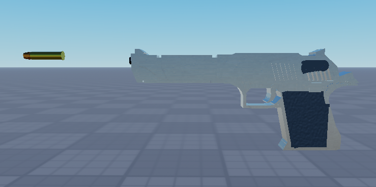
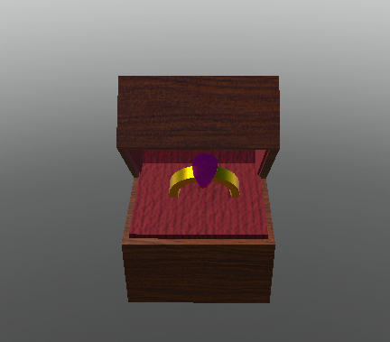

<!DOCTYPE html>
<html>
<head>
    <title>I'm_caca | Portfolio</title>
    <meta charset="utf-8">
    <meta name="viewport" content="width=device-width, initial-scale=1">

    <link rel="stylesheet" href="style.css">
</head>

<body>

    <h1 class="title">
        I'm_caca | Portfolio
    </h1>

    

        

            Hello! My name is I'm_caca, and I'm an indie game developer
            and 3D modeler creating games, assets, and interactive experiences.
        

        

            My game development journey started over five years ago with
            Roblox Studio, where I created smaller games, learned game design,
            and developed my skills in Luau scripting. Later on, I began
            focusing more on 3D modeling, creating assets, building
            environments, and designing maps for different projects.
        

        

            After working with Roblox Studio, I decided to transition to Unity
            to expand my skills and learn a new engine. I've been developing
            with Unity for the past four months, improving my C# knowledge
            while continuing to develop my skills in game development and 3D art.
        

        

            I enjoy creating detailed 3D models, building environments,
            designing maps, and programming gameplay systems to bring ideas
            into playable experiences.
        

    

    

        I have over <b>5 years of experience</b>
        <b>with Roblox Studio</b> and
        <b>4 months of experience</b>
        <b>with Unity</b>, creating games,
        interactive experiences, and 3D models.

        I'm proficient in Luau
        (Roblox's scripting language) and have
        <b>foundational C# skills</b>
        for Unity development.

    

    

        <a href="https://discord.com/users/1025675124457873459">
            Discord
        </a>

        <a href="#">
            Studio Website
        </a>

         <a href="#">
            Studio Discord Server
        </a>

    

    

        

        

    

</body>
</html>
